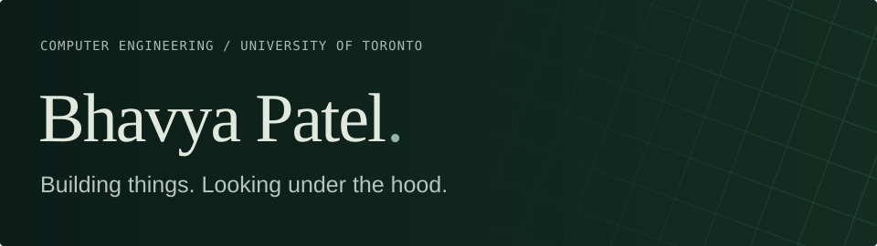
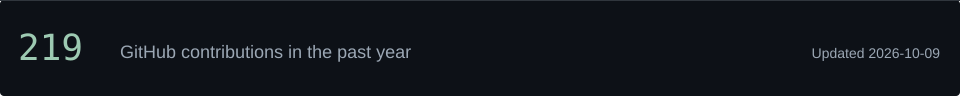

I'm a Computer Engineering student at UofT, interested in **learned world models, interpretability, and ML systems**. I like building useful software and digging into how models work.

[LinkedIn](https://www.linkedin.com/in/bhavya-patel-135826287/)

## Two things I've been working on

<table>
<tr>
<td width="50%" valign="top">

01 / UNDER THE HOOD

### [Chess MoveFormer](https://github.com/BhavyaP45/chess-moveformer)

Does a model trained on chess moves learn the board behind them?

I trained a character-level transformer, probed its internal activations for board state, and tested whether changing those representations changes its move predictions.

Python · PyTorch · NumPy

</td>
<td width="50%" valign="top">

02 / OUT IN THE WORLD

### [PropertyScout](https://github.com/BhavyaP45/propertyscout)

Finding a place should mean more than matching a few filters.

I'm building a Chrome extension for home discovery, with personalized listing scores and explanations of how a place fits what you're looking for.

TypeScript · Next.js · Supabase Cloudflare Worker · WXT 

</td>
</tr>
</table>

## Currently curious about

What models represent internally, how those representations affect predictions, and how to turn ML into software people can actually use.

